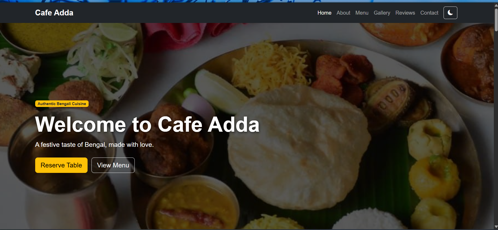
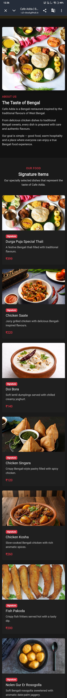
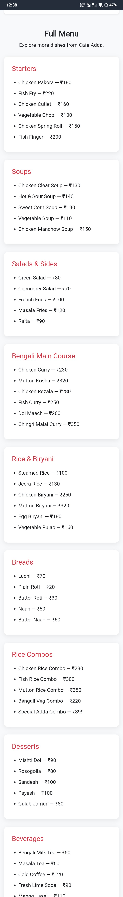
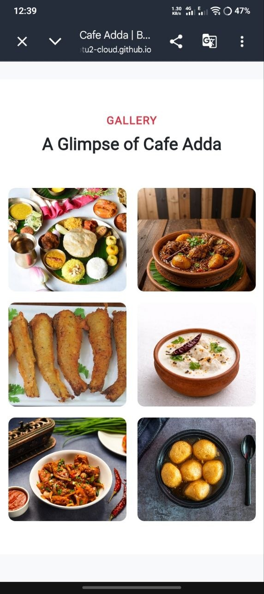
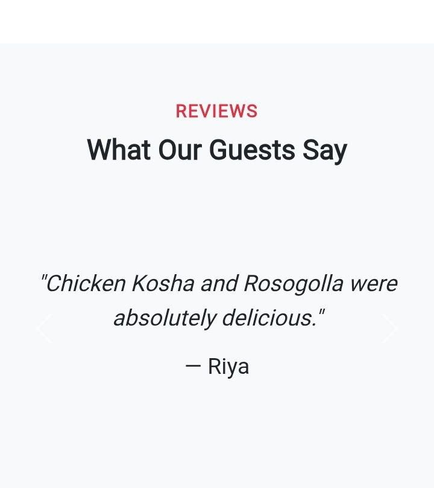
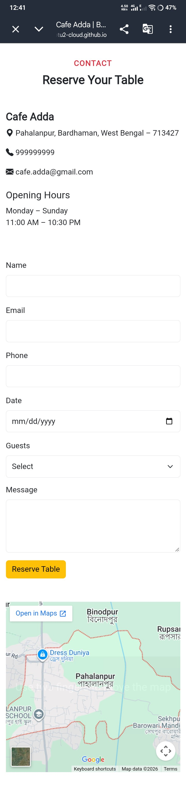
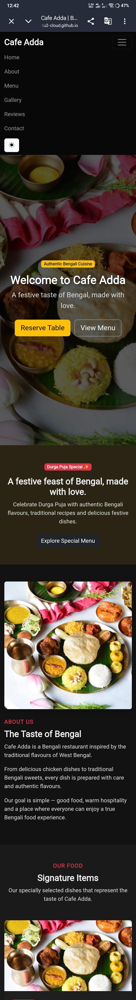

```markdown
# Cafe Adda - Bengali Restaurant Landing Page

## About the Project

Cafe Adda is a responsive single-page restaurant website based on a Bengali restaurant theme.

The website showcases authentic Bengali food, signature dishes, a full menu, customer reviews, gallery, contact information and table reservation functionality.

The website also includes a Durga Puja Special section and Dark Mode feature.

---

## Features

- Responsive restaurant landing page
- Sticky navigation bar
- Smooth scrolling
- Active navigation link highlight
- Hero section with CTA buttons
- Bengali restaurant About section
- 7 Signature Food Items with images
- Full menu with 20+ food items
- Durga Puja Special section
- Image gallery with Bootstrap modal
- Customer testimonials carousel
- Contact and table reservation form
- JavaScript form validation
- Email and phone validation
- Google Maps location
- Dark Mode toggle
- Dark Mode preference saved using localStorage
- Responsive design
- Semantic HTML and image alt text
- No horizontal scrolling

---

## Technologies Used

- HTML5
- CSS3
- JavaScript
- Bootstrap 5
- Bootstrap Icons
- Google Maps Embed

---

## Project Structure

```text
Bengal_bites/
│
├── assets/
│   ├── durga-puja-thali.jpg
│   ├── chicken-saate.jpg
│   ├── doi-bora.jpg
│   ├── chicken-singara.jpg
│   ├── chicken-kosha.jpg
│   ├── fish-pakoda.jpg
│   └── nolen-gur-rosogolla.jpg
│
├── css/
│   └── custom.css
│
├── js/
│   └── main.js
│
├── screenshots/
│   ├── home.png
│   ├── about.png
│   ├── signature-menu.png
│   ├── full-menu.png
│   ├── gallery.png
│   ├── reviews.png
│   ├── contact.png
│   └── dark-mode.png
│
├── index.html
└── README.md
```

---

## Main Sections

### Hero Section

The hero section introduces Cafe Adda with the restaurant name, tagline and call-to-action buttons.

### About Section

A short story about Cafe Adda and its Bengali food concept.

### Signature Menu

The website highlights 7 signature dishes:

- Durga Puja Special Thali
- Chicken Saate
- Doi Bora
- Chicken Singara
- Chicken Kosha
- Fish Pakoda
- Nolen Gur Er Rosogolla

### Full Menu

The full menu contains more than 20 items divided into different categories such as Starters, Soups, Bengali Main Course, Rice & Biryani, Breads, Desserts and Beverages.

### Gallery

A responsive food gallery is provided. Clicking an image opens it in a Bootstrap modal.

### Customer Reviews

Customer testimonials are displayed using a Bootstrap carousel.

### Contact & Reservation

The contact section contains:

- Restaurant address
- Phone number
- Email
- Opening hours
- Google Maps
- Table reservation form

### Dark Mode

Users can switch between light and dark mode. The selected mode is saved using browser localStorage.

---

## Form Validation

The reservation form uses JavaScript validation for:

- Required fields
- Name length
- Valid email format
- Phone number
- Date selection
- Number of guests
- Message length

---

## How to Run the Project

### Using Live Server

1. Open the project folder in VS Code.
2. Install the Live Server extension.
3. Open `index.html`.
4. Click **Go Live**.
5. The website will open in the browser.

### Direct Method

Open the `index.html` file in a modern web browser.

---

## Screenshots

### Home Page


### Signature Menu


### Full Menu


### Gallery


### Reviews


### Contact Section


### Dark Mode


## Restaurant Information

**Restaurant:** Cafe Adda

**Address:**  
Pahalanpur, Bardhaman, West Bengal – 713427

**Phone:**  
999999999

**Email:**  
cafe.adda@gmail.com

**Opening Hours:**  
Monday - Sunday  
11:00 AM - 10:30 PM

---

## Project Purpose

This project was created as a responsive restaurant landing page demonstrating frontend web development skills using HTML, CSS, JavaScript and Bootstrap.

---

## Author

Cafe Adda Restaurant Landing Page

---

## License

This project is created for educational and project submission purposes.
```
